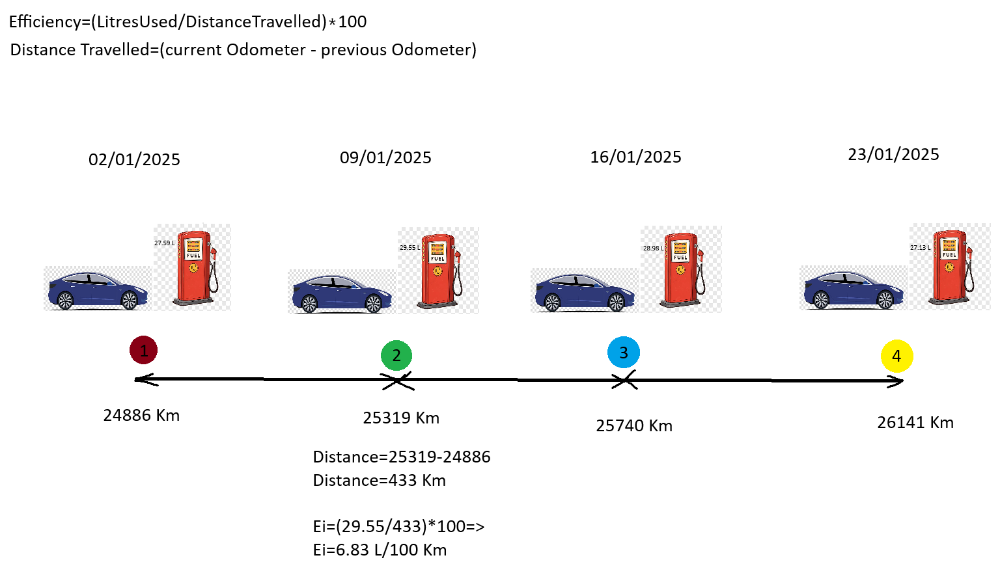
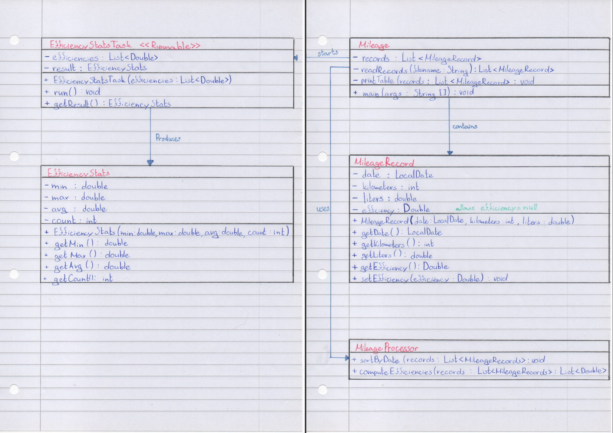
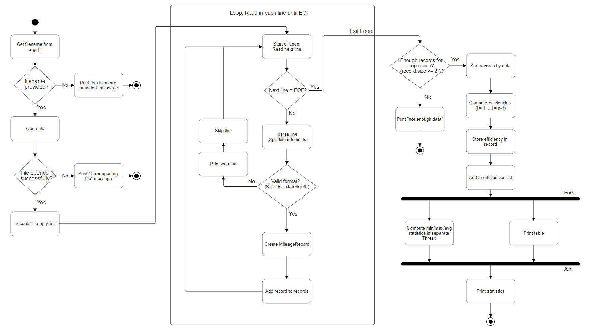

# Java_CA2_Fuel_Efficiency
Github repository for collaborative work during the Java &amp; Algorithms CA2

---

## Introduction:

I keep a file with details of my car's mileage. Whenever I fill up with petrol I enter the odometer reading (the total km the car has travelled) and the amount of petrol (in litres) 
I've just bought, beside each other on a single line. 
A sample of the text file’s contents might look as follows. 
NB I always fill my tank right to the top. 
However, I am a careless record keeper – the readings are not necessarily in increasing date order! 

## Project Requirements:

### Functional Requirements

- User must run the program with a command and filename
- Read mileage data from a file (parsing)
- Store the data in a suitable data structure
- Include suitable exception handling (file opening/closing errors)
- Read each entry from the file
- Calculate fuel efficiency for each fill
- Store the calculated results
- Calculate minimum, maximum, and average efficiency
- Perform the statistical calculations in a separate thread

### Non-Functional Requirements

- The program should be memory-efficient and modular
- Java code should be properly formatted and indented (e.g., using `astyle`)

---

---
# The Big picture


# Design
## UML Class Diagram
Below is a Class Diagram representing all currently accounted for classes and their members/methods:


## Hand-Drawn UML Class Diagram
Below is the hand drawn version of the UML Class diagram requested by the professor at the start of the next Lab session:
	

## High-Level Activity Diagram
The activity diagram shown below describes the functional flow of the program.
It illustrates the overall sequence of operations without defining the internal implementation details of each method.
	

A lower-level activity diagram is currently being developed. This diagram will include explicit method calls and detailed internals to complement the high-level overview shown above.

**TODO:** 
- [ ] Description of the program design and reasoning behind it.  
- [ ] Create **Low-Level Activity Diagram** including method calls and their definitions.
- [ ] Add the **Hand drawn Activity Diagram** requested by the professor.
- [ ] Implement a **Test Harness** for the program including definitions for expected inputs and outputs of each test.
- [ ] Include UML diagrams where appropriate.


## Ideas: 
The program may:

- Sort records by date
- Calculate fuel efficiency (L/100km)
- Compute minimum, maximum, and average efficiency
- Perform statistical calculations in a separate thread
- Include proper exception handling
- Be modular and memory-efficient


## Build

The program was developed collaboratively using a pair-programming approach during development sessions. One team member acted as the primary coder while the other reviewed the logic, suggested improvements, and searched documentation where needed. These roles were swapped regularly so that both team members contributed to the implementation, debugging, and testing of the final solution.

The implementation follows the class structure described in the design section.

- `Mileage` handles the main program flow, including file input, sorting the mileage records by date, computing efficiencies, creating the statistics thread, and printing the final results.
- `MileageRecord` stores the data for each mileage entry, including the date, odometer reading, litres filled, and computed efficiency. Getter and setter methods were used to allow controlled access to the record data.
- `EfficiencyStatsTask` performs the minimum, maximum, and average efficiency calculations in a separate thread by implementing the `Runnable` interface.

Several Java features were used in the implementation:

- Java Collections (`List` and `ArrayList`) to store and manage the set of `MileageRecord` objects
- Comparator-based sorting using `Comparator.comparing()` to order records by date
- File parsing using `Scanner` to read and parse the input file
- Java Time API (`LocalDate` and `DateTimeFormatter`) to correctly parse and store dates
- Multithreading using the `Runnable` interface and `Thread` class to compute efficiency statistics
- Exception handling using `try-catch` blocks to handle file input errors and thread interruption

A separate test harness was also developed so that individual methods could be tested independently before integration into the final program.

In addition, a simple `Makefile` was used to automate compiling and testing. This made it easier to repeatedly run the program on both normal and edge-case input files such as empty files, single-record files, negative-distance files, zero-distance files, and files containing blank lines.

---

## Results and Discussion

The program was tested using the sample file `mileage_tiny.txt`, which contains four mileage entries. The tests described in the **Tests and Expected Outputs** section were carried out using the test harness to verify that each stage of the program behaved as expected.

A `Makefile` was also used to automate compilation and testing across multiple input files in the `data` directory. This allowed the program to be checked not only on the normal sample file, but also on edge-case files such as:

- `empty.txt`
- `mileage_uno.txt`
- `negative_distance.txt`
- `zero_distance.txt`
- `blank_lines_mileage.txt`

This helped confirm that the program behaved robustly across both normal and unusual input cases.

### Table 1: Testing Results

| Component Tested | Expected Output | Observed Output | Pass/Fail |
|---|---|---|---|
| `readRecords()` | Each entry from the file printed with correct values | Records read in from the file: `4` records. Entries were loaded correctly with the correct date, kilometers, litres, and initial `NaN` efficiency values. | Pass |
| `sortRecords()` | Each entry from the file printed in chronological order | Records were sorted correctly into date order: `2025-01-02`, `2025-01-09`, `2025-01-16`, `2025-01-23`. | Pass |
| `computeEfficiencies()` | Each computed efficiency printed, including `NaN` for the first record | Efficiencies were computed correctly as: `NaN`, `6.824480369515011`, `6.883610451306413`, `6.765586034912719`. | Pass |
| `EfficiencyStatsTask` | Minimum, maximum, and average statistics printed correctly | Statistics were calculated correctly: Min = `6.765586034912719`, Max = `6.883610451306413`, Avg = `6.8245589519113805`. | Pass |

Overall, the testing showed that the program met the main functional requirements. The input file was read correctly, the records were sorted into chronological order, efficiencies were calculated correctly, and the statistics thread produced the expected minimum, maximum, and average values. The additional edge-case tests run through the `Makefile` also helped confirm that the program handled unusual inputs in a stable and predictable way.

---

## How to Run

### Compile the program
```bash
make compile
```
### Compile and output results to Testing.txt
```bash
make all
```
### Compile and output results to terminal
```bash
make run-tests
```
### Run MileageTestHarness
```bash
make run-harness
```
### Rmove compiled .class files
```bash
make clean
```
### Run the program with an input file
```bash
java -cp bin Mileage data/mileage_tiny.txt
```
### Additionally, you can add your own text file with the correct format in the data/ directory and input it instead of mileage_tiny.txt
